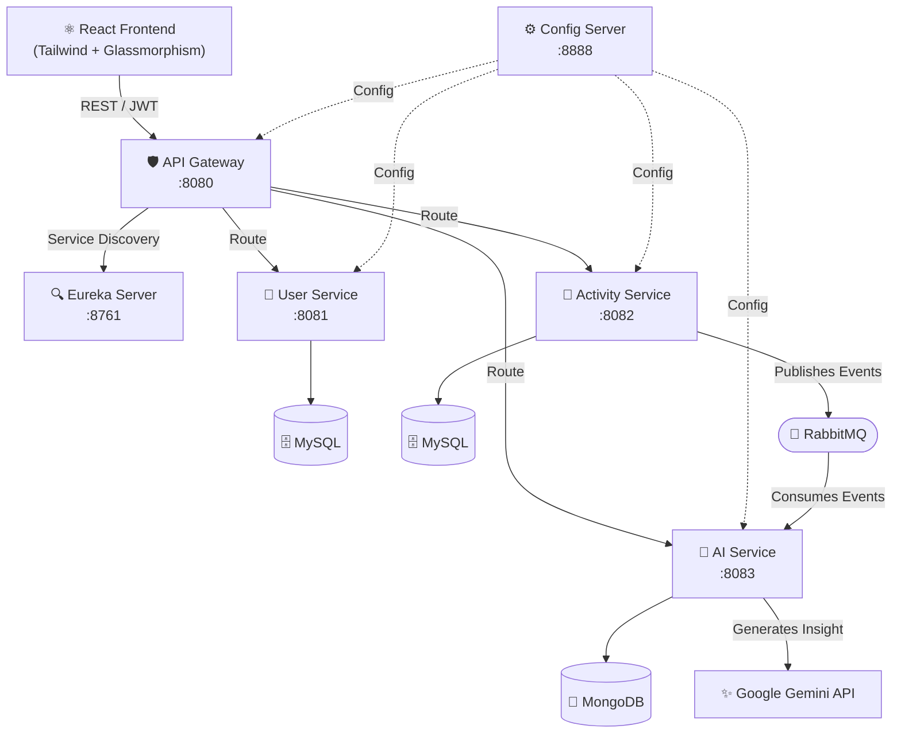

<div align="center">

<!-- Animated Header -->
<a href="https://github.com">
  
</a>

<br/>

<!-- Animated Typing Banner -->
<a href="https://git.io/typing-svg">
  
</a>

<br/><br/>

**A scalable, full-stack microservices fitness platform empowering users to track activities, set goals, and receive AI-driven personalized recommendations.**

<br/>


<br/>


<br/><br/>


</div>

<br/>

## 🌟 Overview

FitNovaAI is a comprehensive fitness tracking application architected using **Microservices** and designed with modern **Glassmorphism UI** aesthetics. It leverages the **Google Gemini API** to analyze users' fitness data and provide intelligent, personalized training recommendations, safety guidelines, and improvements.

The frontend is built with **React and TailwindCSS**, supporting seamless Dark Mode and elegant animations. The backend uses **Spring Boot**, **Spring Cloud Gateway**, and **Netflix Eureka**, with asynchronous event-driven communication powered by **RabbitMQ**.

---

## 🧩 Core Microservices

| Service | Responsibility | Key Tech |
|---|---|---|
| 🛡️ **API Gateway** | Central entry point, routes traffic, and validates Firebase JWT tokens for secure access. | Spring Cloud Gateway, Spring Security |
| 📍 **Config & Discovery** | Centralized configuration management and dynamic service registration/discovery. | Spring Cloud Config, Netflix Eureka |
| 👤 **User Service** | Handles user profile management and syncs authentication state with Firebase. | Spring Boot, Firebase Auth, MySQL |
| 🏃 **Activity Service** | High-throughput service for recording daily fitness activities and tracking progress. | Spring Boot, MySQL |
| 🤖 **AI Service** | Asynchronously processes activity data via RabbitMQ to generate AI fitness recommendations. | Spring Boot, Gemini API, MongoDB |

---

## 🏗️ Architecture Design


```mermaid
graph TD
    UI["⚛️ React Frontend<br/>(Tailwind + Glassmorphism)"]
    Gateway["🛡️ API Gateway<br/>:8080"]
    Eureka["🔍 Eureka Server<br/>:8761"]
    User["👤 User Service<br/>:8081"]
    Activity["🏃 Activity Service<br/>:8082"]
    AI["🤖 AI Service<br/>:8083"]
    Config["⚙️ Config Server<br/>:8888"]
    DB1[("🗄️ MySQL")]
    DB2[("🗄️ MySQL")]
    DB3[("🍃 MongoDB")]
    RMQ(["🐇 RabbitMQ"])
    Gemini["✨ Google Gemini API"]

    UI -->|"REST / JWT"| Gateway
    Gateway -->|"Service Discovery"| Eureka

    Gateway -->|"Route"| User
    Gateway -->|"Route"| Activity
    Gateway -->|"Route"| AI

    Config -.->|"Config"| User
    Config -.->|"Config"| Activity
    Config -.->|"Config"| AI
    Config -.->|"Config"| Gateway

    User --> DB1
    Activity --> DB2
    AI --> DB3

    Activity -->|"Publishes Events"| RMQ
    RMQ -->|"Consumes Events"| AI

    AI -->|"Generates Insight"| Gemini
```

---

## ✨ Key Features

<details>
<summary><b>🎨 Modern Glassmorphism UI</b></summary>
<br/>

Beautiful, interactive React frontend with seamless light/dark mode and smooth animations.

</details>

<details>
<summary><b>🏗️ Microservices Architecture</b></summary>
<br/>

Independently scalable services designed with resilience in mind.

</details>

<details>
<summary><b>🔐 Centralized Security</b></summary>
<br/>

API Gateway acts as an OAuth2 Resource Server validating Firebase tokens.

</details>

<details>
<summary><b>🤖 Event-Driven AI Recommendations</b></summary>
<br/>

When an activity is tracked, an event is published to RabbitMQ. The AI service consumes this, prompts the Gemini API, and stores personalized recommendations in MongoDB.

</details>

<details>
<summary><b>🔍 Service Discovery</b></summary>
<br/>

Automated instance registration and load balancing via Netflix Eureka.

</details>

<details>
<summary><b>🛡️ Resilient AI Fallback Mechanism</b></summary>
<br/>

Integrated robust error handling to manage Gemini API rate limits (HTTP 429) or unavailability. A rule-based mock response mode automatically provides context-aware fitness suggestions based on the activity type, ensuring the system remains functional and responsive at all times without crashing the message queue.

</details>

---

## 🚀 Getting Started

### Prerequisites

<div>


</div>

<br/>

### Running the Backend

Ensure you start the configuration and discovery services first:

```bash
# 1. Config Server (Port 8888)
cd configserver && ./mvnw spring-boot:run

# 2. Eureka Server (Port 8761)
cd eureka && ./mvnw spring-boot:run

# 3. Microservices (Wait for Config & Eureka to be up)
cd gateway && ./mvnw spring-boot:run
cd activityservice && ./mvnw spring-boot:run
cd aiservice && ./mvnw spring-boot:run
cd userservice && ./mvnw spring-boot:run
```

### Running the Frontend

```bash
cd fitness-app-frontend
npm install
npm run dev
```

---

<div align="center">


<!-- Animated Footer Wave -->
<a href="https://github.com">
  
</a>


<br/><br/>

<sub>Built with modern architecture best practices to showcase scalability, beautiful UI/UX, and AI integration.</sub>

</div>
