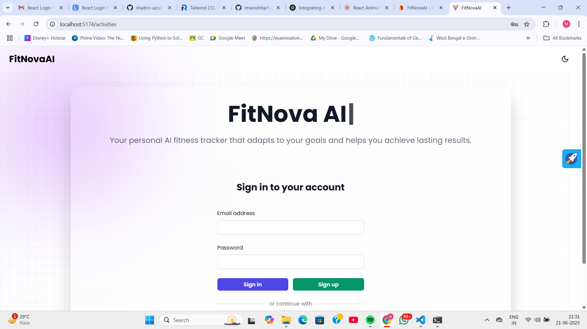

# FitNovaAI(Microservices Project)

_Note : > ⚠️ This project is currently in active development. Some environment-specific configuration values are still hardcoded temporarily and will be migrated to `.env` soon._
---

**FitNova** is a full-stack microservices-based fitness application that helps users track their physical activities, leverage AI-generated recommendations, and manage user goals and history efficiently.

---

## Project Overview

This project is built using the **Microservices Architecture**, separating core functionalities into three services:
- **User Service** – Handles user authentication and profiles
- **Activity Service** – Tracks daily fitness activities
- **AI Service** – Provides intelligent suggestions using AI (Gemini API integration planned)

The UI is React-based and integrates with all services for a seamless experience.

---


## Tech Stack

- **Frontend**: React, Tailwind CSS
- **Backend**: Spring Boot (REST APIs), Firebase(Authetication)
- **Database**: MySQL, MongoDB
- **AI**: Gemini API (planned)
- **Architecture**: Microservices with Eureka Server and RabbitMQ for inter-service communication

---

## System Flow Diagram

_A visual diagram explaining service interactions and request flow will be placed here._


---

## UI Preview




---

## Current Status

- [x] User Registration and Login (Firebase)
- [x] Basic Activity Tracker
- [ ] Gemini API integration (in progress)
- [ ] Backend service communication (in progress)
- [ ] Gateway & RabbitMQ setup (in progress)

---

## Getting Started

Each service can be run individually:

```bash
# Example: Running user-service
cd user-service
./mvnw spring-boot:run

